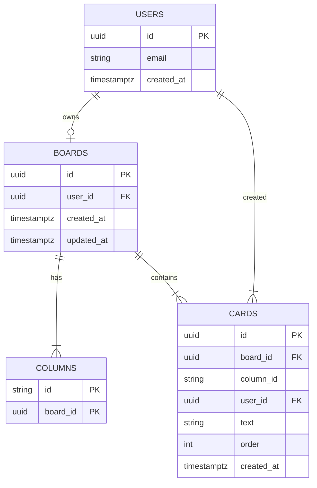

# Database Design — 데이터 모델 설계
# Kanban Board

## 1. 저장 전략 (현재 v1.1 — localStorage)

| 항목 | 내용 |
|------|------|
| 저장소 | `window.localStorage` |
| 키 | `kanban_board_{userId}` (사용자별 격리) |
| 게스트 ID 키 | `kanban_guest_id` |
| 형식 | JSON 문자열 |
| 저장 타이밍 | 카드 추가 / 삭제 / 드롭 완료 시 |
| 복원 타이밍 | `DOMContentLoaded` → 게스트 ID 확인 → 해당 키로 로드 |

---

## 2. 데이터 모델

### User 객체

```typescript
type User = {
  id: string;           // 게스트: crypto.randomUUID() / 인증: Supabase user.id
  name: string;         // 게스트: "Guest" / 인증: 등록된 이름
  email: string | null; // 게스트: null / 인증: 이메일
  isGuest: boolean;
}
```

### 최상위 저장 구조

```typescript
type BoardData = {
  userId: string;       // 소유자 ID (데이터 격리의 핵심 필드)
  columns: Column[];
  updatedAt: string;    // ISO 8601
}
```

### Column 객체

```typescript
type Column = {
  id: 'todo' | 'in-progress' | 'done';
  cards: Card[];        // 순서 있는 배열 (index 0 = 최상단)
}
```

### Card 객체

```typescript
type Card = {
  id: string;           // crypto.randomUUID()
  userId: string;       // 카드 생성자 ID (다중 사용자 환경에서 소유자 추적)
  text: string;
  columnId: string;     // 현재 소속 컬럼 (Supabase 전환 시 별도 컬럼으로 정규화 가능)
  order: number;        // 컬럼 내 순서 (Supabase 전환 시 재정렬 기준)
  createdAt: string;    // ISO 8601
}
```

---

## 3. 저장 데이터 예시

```json
{
  "userId": "a1b2c3d4-e5f6-7890-abcd-ef1234567890",
  "updatedAt": "2026-05-13T09:30:00.000Z",
  "columns": [
    {
      "id": "todo",
      "cards": [
        {
          "id": "f47ac10b-58cc-4372-a567-0e02b2c3d479",
          "userId": "a1b2c3d4-e5f6-7890-abcd-ef1234567890",
          "text": "디자인 시안 검토",
          "columnId": "todo",
          "order": 0,
          "createdAt": "2026-05-13T09:00:00.000Z"
        }
      ]
    },
    {
      "id": "in-progress",
      "cards": [
        {
          "id": "550e8400-e29b-41d4-a716-446655440000",
          "userId": "a1b2c3d4-e5f6-7890-abcd-ef1234567890",
          "text": "로그인 기능 개발",
          "columnId": "in-progress",
          "order": 0,
          "createdAt": "2026-05-13T09:02:00.000Z"
        }
      ]
    },
    {
      "id": "done",
      "cards": []
    }
  ]
}
```

---

## 4. 향후 Supabase 스키마 (v2.0)

localStorage에서 Supabase DB로 전환 시 아래 스키마를 사용한다.
Card 모델의 `userId`, `columnId`, `order` 필드는 이 전환을 위해 **현재부터 저장**한다.

### 테이블 구조

```sql
-- users 테이블은 Supabase Auth가 자동 관리
-- auth.users (id, email, created_at, ...)

create table boards (
  id         uuid primary key default gen_random_uuid(),
  user_id    uuid not null references auth.users(id) on delete cascade,
  created_at timestamptz default now(),
  updated_at timestamptz default now(),
  unique(user_id)   -- 사용자당 보드 1개
);

create table columns (
  id         text not null,             -- 'todo' | 'in-progress' | 'done'
  board_id   uuid not null references boards(id) on delete cascade,
  primary key (id, board_id)
);

create table cards (
  id          uuid primary key default gen_random_uuid(),
  board_id    uuid not null references boards(id) on delete cascade,
  column_id   text not null,
  user_id     uuid not null references auth.users(id),
  text        text not null,
  "order"     integer not null default 0,
  created_at  timestamptz default now()
);

-- RLS: 본인 데이터만 접근
alter table boards enable row level security;
alter table cards  enable row level security;

create policy "boards: owner only" on boards
  using (auth.uid() = user_id);

create policy "cards: owner only" on cards
  using (auth.uid() = user_id);
```

### ERD



---

## 5. CRUD 명세 (현재 v2.0 — Supabase Auth + localStorage)

### 사용자 초기화 (인증 기반)

```js
// auth.js
async function getAuthUser() {
  const { data: { session } } = await _supabase.auth.getSession();
  if (!session) return null;
  const u = session.user;
  return {
    id: u.id,
    name: u.user_metadata?.full_name || u.user_metadata?.user_name || u.email?.split('@')[0],
    email: u.email,
    avatar: u.user_metadata?.avatar_url || null,
    isGuest: false,
  };
}

// app.js — init()
const user = await getAuthUser();
if (!user) { window.location.href = 'index.html'; return; }
currentUser = user;
```

### 읽기 (Load)

```js
async function load(userId) {
  const raw = localStorage.getItem(`kanban_board_${userId}`);
  if (!raw) return null;
  try { return JSON.parse(raw); } catch { return null; }
}
```

### 저장 (Save)

```js
async function save(userId, data) {
  const payload = { ...data, userId, updatedAt: new Date().toISOString() };
  localStorage.setItem(`kanban_board_${userId}`, JSON.stringify(payload));
}
```

### 카드 DOM 속성

```html
<div class="card"
     draggable="true"
     data-id="f47ac10b-..."
     data-user-id="a1b2c3d4-..."
     data-column-id="todo"
     data-created-at="2026-05-13T09:00:00.000Z">
  <p>카드 내용</p>
  <button class="delete-btn" aria-label="카드 삭제">✕</button>
</div>
```

---

## 6. 데이터 생명주기

```
[인증 — index.html]
  Google/GitHub OAuth 또는 이메일/비밀번호 로그인
  → Supabase 세션 생성 → board.html 리다이렉트

[초기화 — board.html]
  getAuthUser() → 미인증 시 index.html 리다이렉트
  → currentUser = { id: supabase.user.id, name, email, avatar }
  → Storage.load(currentUser.id)
    → 데이터 있음 → 보드 렌더링
    → 데이터 없음 → HTML 기본 카드 유지

[카드 추가]
  createCard(text, currentUser.id) → DOM append → Storage.save()

[카드 삭제]
  card.remove() → Storage.save()

[카드 이동]
  drop → DOM 순서 변경 → Storage.save()

[로그아웃]
  signOut() → Supabase 세션 제거 → index.html 리다이렉트

[v3.0 Storage 전환]
  storage.js 내부만 교체
  Storage.load/save → Supabase DB 호출 (app.js 수정 없음)
```

---

## 7. 용량 및 격리 고려

- localStorage 제한 약 5MB. 텍스트 카드만 저장하므로 수천 개 카드도 여유 있음.
- 사용자별 키(`kanban_board_{userId}`)로 격리되므로 동일 브라우저의 다른 게스트와 충돌 없음.
- Supabase 전환 시 Row Level Security(RLS)로 서버 수준 격리를 보장한다.
