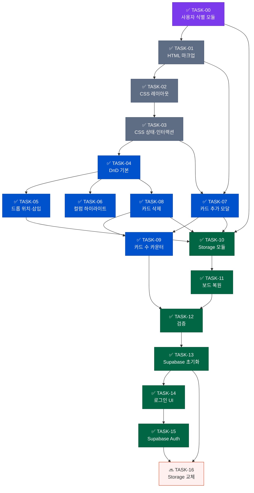

# Tasks — AI Agent 작업 목록
# Kanban Board

## 작업 목록 구조
각 태스크는 독립적으로 실행 가능하도록 작성되었습니다.
의존성이 있는 경우 `depends_on` 항목에 표기합니다.

**범례**: ✅ 완료 · 🔜 예정

---

## 의존 그래프



> 색이 채워진 노드(보라·회색·파랑·초록): 완료 · 흰 배경 빨강: 미래 예정 (Phase 5)

---

## Phase 0: 사용자 식별 구조

### ✅ TASK-00. 사용자 식별 모듈 구현
```
파일: app.js
상태: 완료

구현 내용:
  - initGuestUser(): localStorage의 kanban_guest_id 확인
    - 없으면 crypto.randomUUID() 생성 후 저장
  - currentUser 전역 상태: { id, name: 'Guest', email: null, isGuest: true }
  - renderUserBadge(): 헤더 .user-area에 <span class="user-badge">Guest</span> 렌더링

완료 조건 확인:
  ✅ 첫 방문 시 UUID가 생성되어 localStorage에 저장됨
  ✅ 새로고침 후에도 동일한 ID 유지됨
  ✅ 헤더에 "Guest" 배지 표시됨
```

---

## Phase 1: 기반 구조 구현

### ✅ TASK-01. HTML 보드 마크업 작성
```
파일: index.html
상태: 완료

구현 내용:
  - <header>에 h1 + .user-area 추가
  - <main class="board"> + 3개 .column (todo, in-progress, done)
  - 각 컬럼: .column-header, .card-list, .add-card-btn
  - 초기 샘플 카드 6개
  - #modal-overlay, #card-input, #modal-cancel, #modal-confirm
  - <script src="storage.js"> + <script src="app.js"> 순서로 로드
depends_on: TASK-00
```

### ✅ TASK-02. CSS 레이아웃 스타일 작성
```
파일: style.css
상태: 완료

구현 내용:
  - reset, body, header (display:flex, justify-content:space-between)
  - .user-area, .user-badge (반투명 흰색 배지)
  - .board Flexbox 수평, .column 280px, .card 흰색 shadow
depends_on: TASK-01
```

### ✅ TASK-03. CSS 상태 및 인터랙션 스타일 작성
```
파일: style.css
상태: 완료

구현 내용:
  - .card.dragging (opacity:0.4, rotate(2deg) scale(1.02))
  - .column.drag-over (background:#d4e4ff, outline 점선)
  - .drop-placeholder (height:60px, 파란 점선 박스)
  - .delete-btn (hover 시 display:block, hover:빨간 배경)
  - .modal-overlay/.modal/.modal-overlay.active
depends_on: TASK-02
```

---

## Phase 2: 핵심 기능 구현

### ✅ TASK-04. 드래그앤드롭 기본 구현
```
파일: app.js
상태: 완료

구현 내용:
  - createPlaceholder(), removePlaceholder()
  - board.dragstart → draggedCard 저장, setTimeout으로 .dragging 클래스 추가
  - board.dragend → 상태 초기화, updateCounts()
depends_on: TASK-01, TASK-03
```

### ✅ TASK-05. 드롭 위치 계산 및 삽입
```
파일: app.js
상태: 완료

구현 내용:
  - getDragAfterElement(list, y): getBoundingClientRect()로 삽입 위치 계산
  - board.dragover → placeholder 이동
  - board.drop → 카드 삽입 → Storage.save(currentUser.id, getBoardData())
depends_on: TASK-04
```

### ✅ TASK-06. 컬럼 drag-over 하이라이트
```
파일: app.js
상태: 완료

구현 내용:
  - dragenter → .drag-over 클래스 추가
  - dragleave (col.contains(e.relatedTarget) 검사) → .drag-over 제거
  - drop → .drag-over 제거
depends_on: TASK-04
```

### ✅ TASK-07. 카드 추가 모달 구현
```
파일: app.js
상태: 완료

구현 내용:
  - .add-card-btn click → targetListId 저장, 모달 열기, cardInput.focus()
  - confirmAdd(): trim() 검사 → createCard(text, currentUser.id) → append
            → Storage.save(currentUser.id, getBoardData()) → closeModal()
  - createCard(text, userId, id, createdAt): data-id, data-user-id, data-created-at 포함
  - Enter(Shift 제외) / Esc / 오버레이 클릭 처리
depends_on: TASK-00, TASK-01, TASK-03
```

### ✅ TASK-08. 카드 삭제 기능 구현
```
파일: app.js
상태: 완료

구현 내용:
  - addDeleteButton(card): ✕ 버튼 생성
    - click → card.remove() → updateCounts() → Storage.save()
  - 기존 HTML 카드에도 init()에서 addDeleteButton() 적용
depends_on: TASK-04
```

### ✅ TASK-09. 카드 수 카운터 구현
```
파일: app.js
상태: 완료

구현 내용:
  - updateCounts(): 모든 .column 순회 → .card 개수를 .card-count에 갱신
  - 카드 추가(confirmAdd), 삭제(addDeleteButton), 드롭(drop/dragend) 시 호출
depends_on: TASK-07, TASK-08
```

---

## Phase 3: 데이터 영속성

### ✅ TASK-10. Storage 추상화 모듈 구현
```
파일: storage.js (별도 파일)
상태: 완료

구현 내용:
  - Storage.load(userId): localStorage.getItem('kanban_board_{userId}') → JSON.parse
  - Storage.save(userId, data): updatedAt 추가 후 JSON.stringify → localStorage.setItem
  - app.js는 Storage 인터페이스만 호출, localStorage 직접 접근 없음
  - 카드 DOM: data-id(UUID), data-user-id, data-column-id, data-created-at 속성 포함
  - getBoardData(): DOM → { columns: [{ id, cards: [...] }] } 직렬화
depends_on: TASK-00, TASK-07, TASK-08, TASK-05
```

### ✅ TASK-11. 보드 복원 구현
```
파일: app.js
상태: 완료

구현 내용:
  - init() 내 Storage.load(currentUser.id) 호출
  - 데이터 있음 → renderBoard(data): 컬럼별 카드 DOM 재생성
  - 데이터 없음 → HTML 기본 카드에 data 속성 부여 + addDeleteButton() 적용
depends_on: TASK-10
```

---

## Phase 4: 검증

### ✅ TASK-12. 기능 체크리스트 검증
```
방법: 브라우저에서 board.html 직접 열기
상태: 완료

체크 항목:
  ✅ 초기 렌더링 (컬럼 3개, 카드 수 정확성)
  ✅ 드래그앤드롭 (피드백, 하이라이트, placeholder, 삽입, 카운트 갱신)
  ✅ 드롭 후 localStorage kanban_board_{userId} 저장 확인
  ✅ 카드 추가 (data-user-id 확인, 빈값 방지, 모달 동작)
  ✅ 카드 삭제 (저장 반영 확인)
  ✅ 새로고침 후 보드 복원
  ✅ 엣지 케이스 (빈 컬럼 드롭, 전체 삭제 후 추가)
```

---

## Phase 5: Supabase 인증 연동 (v2.0 — 완료)

### ✅ TASK-13. Supabase 프로젝트 초기화
```
파일: auth.js
상태: 완료

구현 내용:
  - Supabase 프로젝트 연결 (pqtmnbbmrovkjmmbudbk.supabase.co)
  - Google OAuth 제공자 활성화 (Google Cloud Console OAuth Client 등록)
  - GitHub OAuth 제공자 활성화 (GitHub OAuth App 등록)
  - Email 제공자 활성화 (이메일 인증 메일 발송)
  - Supabase URL Configuration 설정:
      Site URL: https://ttthhh5.github.io/kanban/
      Redirect URL: https://ttthhh5.github.io/kanban/board.html
depends_on: TASK-12
```

### ✅ TASK-14. 로그인 UI 구현
```
파일: index.html, landing.css
상태: 완료

구현 내용:
  - index.html을 랜딩 페이지로 전환 (기존 보드 → board.html로 이동)
  - Google로 계속하기 / GitHub로 계속하기 소셜 버튼
  - "또는 이메일로 계속하기" 구분선
  - 이메일 + 비밀번호 입력 폼
  - 로그인 / 회원가입 모드 전환 버튼
  - 에러 메시지 한글 번역 (redirect_uri_mismatch, 잘못된 비밀번호 등)
  - 이미 로그인된 경우 board.html 자동 리다이렉트
depends_on: TASK-13
```

### ✅ TASK-15. Supabase Auth 연동
```
파일: auth.js, app.js, board.html
상태: 완료

구현 내용:
  - auth.js: getAuthUser, signInWithGoogle, signInWithGitHub,
             signUpWithEmail(emailRedirectTo 포함), signInWithEmail, signOut
  - board.html: Supabase CDN + auth.js 로드
  - app.js: initGuestUser() 제거, getAuthUser()로 대체
    - 미인증 시 index.html 리다이렉트
    - renderUserInfo(): 아바타(이미지 or 이니셜) + 이름 + 로그아웃 버튼 렌더링
  - style.css: .user-avatar, .user-name, .logout-btn 스타일 추가
depends_on: TASK-14
```

### 🔜 TASK-16. Storage 모듈 Supabase DB로 교체
```
작업:
  - storage.js 내부만 교체 (app.js 수정 없음)
  - Storage.load(userId): Supabase boards/cards 조회
  - Storage.save(userId, data): Supabase upsert
  - boards, columns, cards 테이블 생성 + RLS 설정 (database-design.md 스키마 참조)
depends_on: TASK-13, TASK-15
```

## Phase 6: 배포 (완료)

### ✅ TASK-17. GitHub Pages 배포
```
파일: .github/workflows/deploy.yml (kanban 레포)
상태: 완료

구현 내용:
  - 별도 kanban 레포 (https://github.com/TTTHHH5/kanban) 생성
  - GitHub Actions 워크플로우: main 브랜치 push 시 자동 배포
  - 배포 URL: https://ttthhh5.github.io/kanban/
  - kosa 모노레포 day03/ 폴더에도 동기화
```
