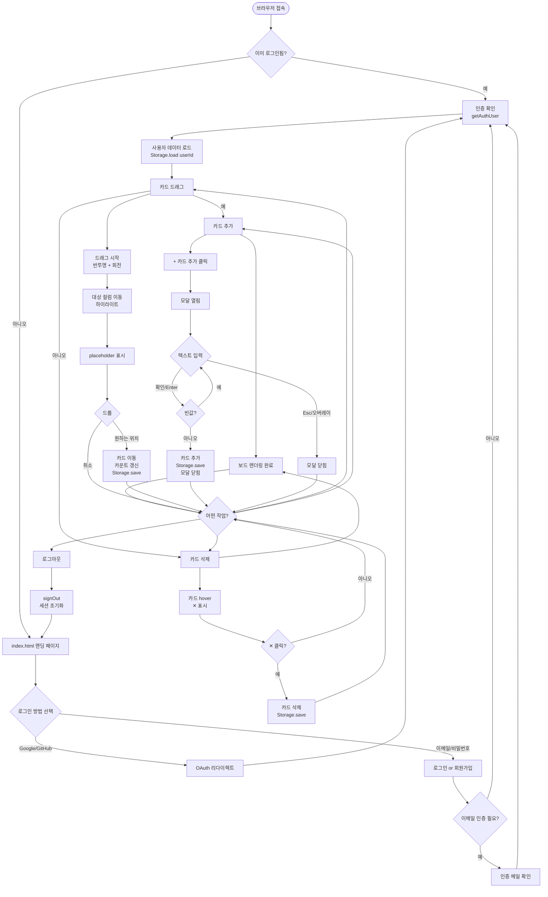
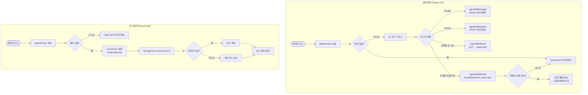
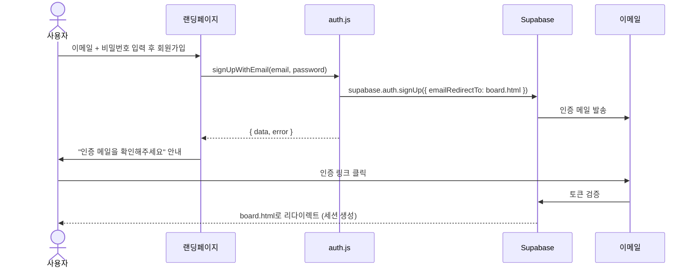
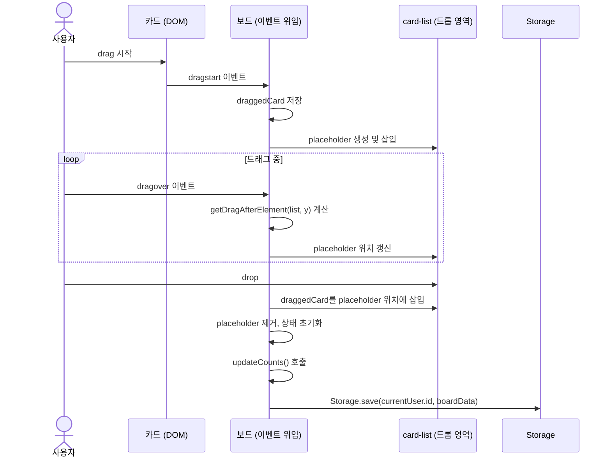
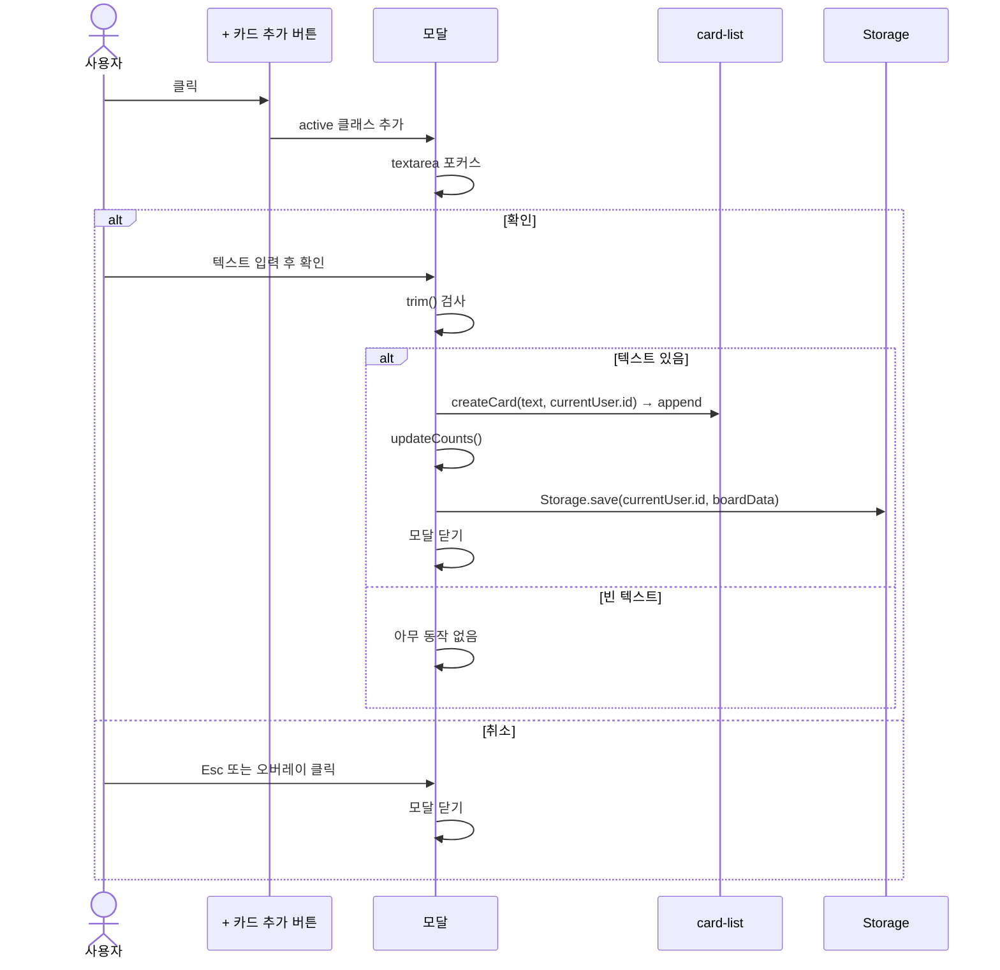

# User Flow — 사용자 흐름도
# Kanban Board

## 1. 전체 여정 개요

사용자의 주요 여정은 다섯 가지입니다.

1. **인증** — 랜딩 페이지에서 Google/GitHub OAuth 또는 이메일/비밀번호로 로그인·회원가입
2. **초기 진입** — 인증 후 보드 진입 및 데이터 복원
3. **카드 이동** — 드래그앤드롭으로 컬럼 간 상태 변경
4. **카드 추가** — 모달을 통해 새 카드 생성
5. **카드 삭제** — hover 후 삭제 버튼으로 카드 제거

---

## 2. 전체 흐름도



---

## 3. 인증 흐름 상세



## 4. 이메일 회원가입 상세 흐름



---

## 5. 카드 이동 상세 흐름



---

## 6. 카드 추가 상세 흐름



---

## 7. 향후 Storage 전환 흐름 (v3.0 — Supabase DB)

현재 보드 데이터는 localStorage에 저장됩니다. v3.0에서 Supabase DB로 전환 시
`storage.js` 내부만 교체하면 `app.js`는 수정 없이 동작합니다.

```mermaid
flowchart LR
    A[app.js] -->|Storage.load / Storage.save| B[storage.js]
    B -->|현재 v2.0| C[localStorage\nkanban_board_{userId}]
    B -.->|v3.0 교체 예정| D[Supabase DB\nboards / cards 테이블]
```
