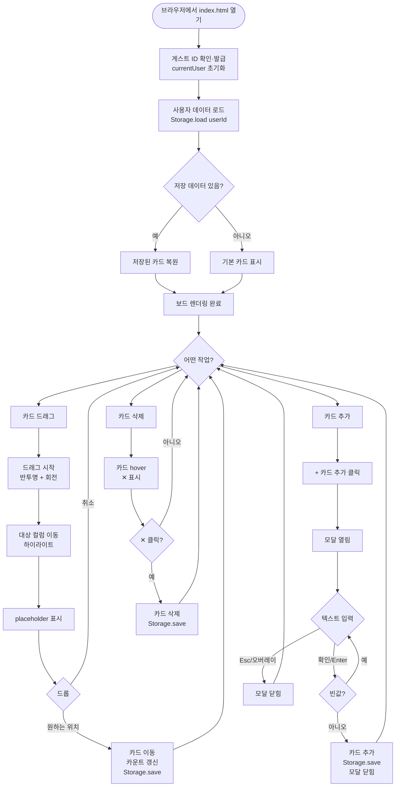
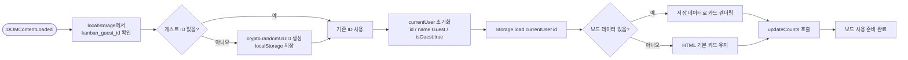
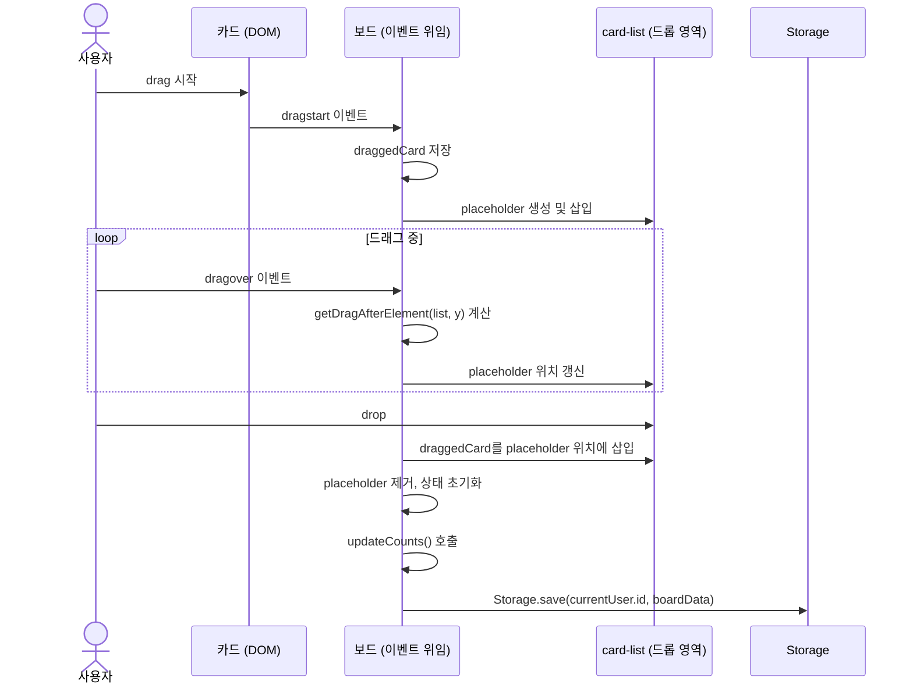
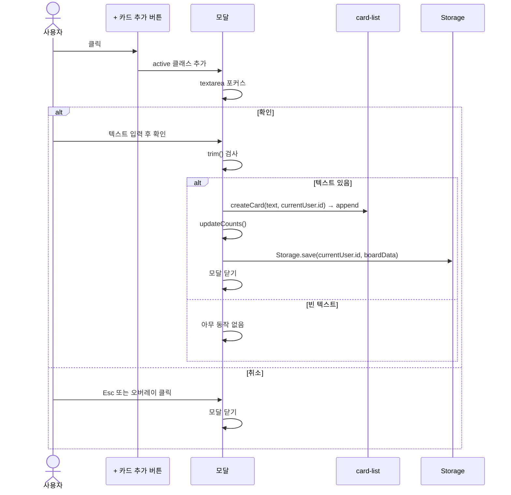
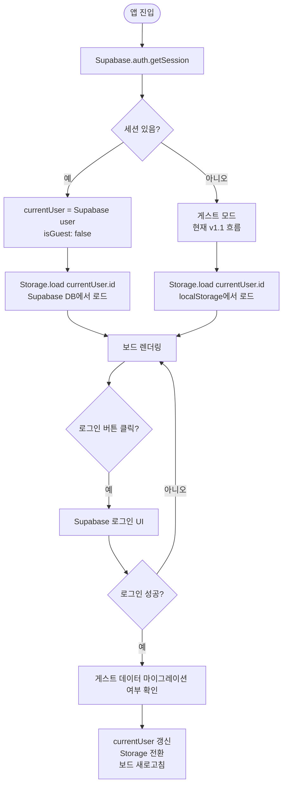

# User Flow — 사용자 흐름도
# Kanban Board

## 1. 전체 여정 개요

사용자의 주요 여정은 네 가지입니다.

1. **초기 진입** — 게스트 ID 발급 및 보드 복원
2. **카드 이동** — 드래그앤드롭으로 컬럼 간 상태 변경
3. **카드 추가** — 모달을 통해 새 카드 생성
4. **카드 삭제** — hover 후 삭제 버튼으로 카드 제거

---

## 2. 전체 흐름도

---

## 3. 페이지 로드 및 사용자 초기화 흐름

---

## 4. 카드 이동 상세 흐름

---

## 5. 카드 추가 상세 흐름

---

## 6. 향후 인증 흐름 (v2.0 — Supabase Auth)

